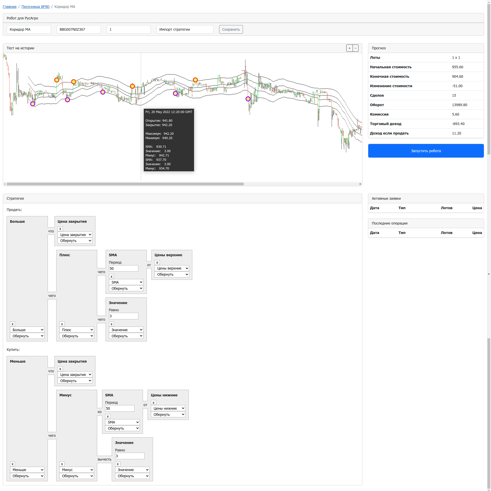

# Робот Тинькофф Инвестиций

Пример робота на языке TypeScript с интерфейсом на React для [конкурса](https://github.com/Tinkoff/invest-robot-contest) роботов.

## Установка и запуск

Откройте два окна терминала. В первом запустите робота:

```
cd robot
npm i
cp .env.example .env

# В файле .env укажите TINKOFF_TOKEN

npm run start
```

Во втором окне запустите пользовательский интерфейс:

```
cd frontend
npm i
cp .env.example .env

npm run start
```

В браузере перейдите по адресу `http://localhost:3000` и введите пароль `admin`.

## Торговые стратегии

Формулы для стратегий накликиваются мышкой в визуальном редакторе и сразу же отображаются и рассчитываются на исторических данных:

<p></p>
